# 1. 需求分析

## 1.1 背景与挑战

调测过程中产生的调试经验（错误日志、根因、修复 diff）散落在一次次调试中，类似问题反复分析。需要建立一套沉淀机制，让经验持续积累、跨场景复用。

落地这一机制存在三个核心实现难点：

1. **Skill 泛滥**：如果把每次调测的经验都做成独立 Skill，会导致 Skill 数量泛滥、维护不可持续。
2. **无感嵌入**：如何无感嵌入调测工作流，让经验的沉淀与检索在调试过程中自然发生，而非依赖人工额外操作。
3. **冷启动**：飞轮启动初期增量经验数量不足，需要存量经验补足，以快速形成可用规模。

## 1.2 总体方案

三个方案分别对应上述三个难点：

**方案①（对应难点①）：经验数据与 Skill 解耦**
参考业界方案设计经验存储格式：调研 Claude-mem 与 LangSmith，融合为"经验 Markdown + Metadata 索引 + 向量检索"三位一体设计。经验数据独立存储在经验中心，**新增经验不增加 Skill 数量**，从根本上规避 Skill 泛滥。

**方案②（对应难点②）：Skill 嵌入工作流、自动触发**
将经验沉淀与检索能力封装为**经验引擎 Skill**：调测 Agent 在失败分析阶段自动检索历史经验，调测结束后自动沉淀，业务人员无需手动调用。

**方案③（对应难点③）：存量 Excel 经验语义入库**
通过字段映射 + 大模型语义总结，将历史 Excel 调测数据自动转换为经验 Markdown 并批量入库，为飞轮启动期提供初始经验池。具体格式与入库策略见第 3 章。

## 1.3 核心需求

### 1.3.1 功能需求

#### 模块 A：经验存储格式与索引（方案①）

- **统一经验格式**：定义五段式经验 Markdown 结构，兼顾人类可读与机器可索引。
- **三位一体存储**：经验 Markdown（文档库）+ Metadata（索引库）+ 向量（向量库）组合存储。
- **数据与 Skill 解耦**：经验数据独立存储于经验中心，与 Skill 生命周期无关。

#### 模块 B：经验录入

- **文档式录入**：提供统一录入接口，以"完整经验文档"为粒度录入，不在调测过程中频繁写入。
- **结构化解析**：解析经验文档，提取 metadata、生成向量、建立检索索引。
- **CTR 数据补充**：调用 CTR 平台拉取结构化执行数据作为补充。

#### 模块 C：经验检索与消费

- **用例 ID 精确检索**：按 `case_id` 完全匹配，返回该用例下所有经验轨迹。
- **语义混合检索**：对 `rag_search_text`（源自 error_log）做 BM25 + 向量混合检索，返回可配置 `top_k`。
- **metadata 过滤**：支持按 `product_version`、`product_name`、`execute_type` 等可选过滤。

#### 模块 D：存量经验迁移（方案③）

- **字段映射**：将历史 Excel 字段映射到经验文档与 metadata。
- **语义总结**：大模型按段落生成规则生成五段式经验内容并批量入库。

#### 模块 E：分析与聚类

- **过滤与统计**：基于 metadata 过滤、统计 `failure_type` 频率等。
- **模式聚类**：对根因/错误模式聚类，沉淀常见问题类型。

### 1.3.2 非功能需求

#### 性能需求

- 单条经验录入端到端 P95 < 2s；检索 P95 < 500ms（`top_k` ≤ 10）。
- 支持万级存量经验离线批量迁移。

#### 可靠性需求

- 录入幂等（同一 `trace_id` 重复录入做 upsert，不产生脏数据）。
- 外部依赖不可用时录入可降级（先落文档库，异步补建索引）。

#### 可扩展性需求

- 检索策略可插拔；存储后端可替换。

#### 安全性需求

- 接口鉴权；环境 IP、日志链接等敏感字段访问可控；日志不打印敏感堆栈。

## 1.4 业界方案对比

**Claude-mem** 面向开发场景，核心是沉淀"经验"而非记录完整执行细节：以"文本经验文档 + metadata 索引 + 向量索引"组合存储，通过向量检索将历史经验注入 prompt，本质是 RAG 模式。

**LangSmith** 面向 Agent 调试监控，核心是记录完整执行轨迹（Trace 由多个 Run 组成），便于回放决策；但数据量大，多数细节对"经验复用"价值有限。

| 对比维度 | 本系统 | Claude-mem | LangSmith |
|---------|-------|-----------|-----------|
| 核心目标 | 调测经验沉淀与复用 | 开发经验记忆复用 | Agent 执行轨迹调试 |
| 记录粒度 | 调测结束后的经验文档 | 关键事件 Observation | 每一步 Run 全量轨迹 |
| 存储形式 | Markdown + metadata + 向量 | 文本 + metadata + 向量 | 结构化 Trace/Run |
| 检索方式 | 精确匹配 + 语义混合检索（RAG） | 向量检索（RAG） | 按 Trace 浏览/过滤 |
| 数据量 | 小（每用例若干条经验） | 小 | 大（全量步骤） |
| 与 Skill 关系 | 数据与 Skill 解耦 | — | — |

**结论**：本系统融合两者——以 Claude-mem 的"经验沉淀 + RAG 复用"为主线，借鉴 LangSmith 的"轨迹"概念但仅保留对复用有价值的关键调试轨迹（debug_trace），在调测结束后一次性生成经验文档。

---

# 2. 系统架构

## 2.1 总体架构

系统采用分层架构。**经验引擎 Skill** 作为消费方/触发方位于应用层，调用接口层暴露的录入与检索接口；核心逻辑层完成解析、索引与检索；数据存储层提供文档、metadata 与向量三类索引；外部依赖 CTR、云见经验中心与 LLM/向量化服务。

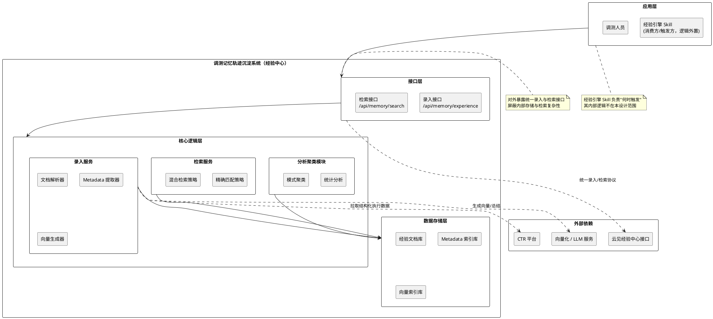

### 架构设计原则

1. **数据与 Skill 解耦**：经验以文档形式独立存储于经验中心，新增经验不增加 Skill。
2. **经验文档为中心**：metadata 与向量均由经验文档派生，文档库为权威源。
3. **读写解耦**：录入服务与检索服务独立演进。
4. **检索策略可插拔**：精确匹配、混合检索以策略模式实现，便于扩展 rerank。
5. **不重复造结构**：CTR 已有完整 schema，直接引用。

### 各层职责

- **应用层**：经验引擎 Skill 在调测工作流中触发录入/检索（逻辑外置）；调测人员亦可直接使用。
- **接口层**：提供录入/检索统一入口，承接鉴权、参数校验、云见协议适配。
- **核心逻辑层**：录入服务负责解析、提取 metadata、生成向量；检索服务负责策略路由与结果组装；分析聚类模块负责统计与聚类。
- **数据存储层**：文档库存经验 Markdown，metadata 库支持过滤，向量库支持语义检索。

## 2.2 核心组件

### 2.2.1 录入服务

接收完整经验文档，解析五段式 Markdown 与 CTR Data 块，提取 metadata，对 `rag_search_text`（源自 error_log）生成向量，分别写入文档库、metadata 库、向量库。

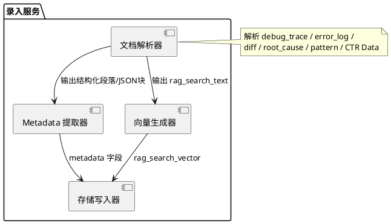

### 2.2.2 检索服务

根据请求路由到合适策略：精确策略按 `case_id` 完全匹配返回该用例全部经验；混合策略对 `rag_search_text` 做 BM25 + 向量召回并融合打分，叠加 metadata 过滤后返回 `top_k`。

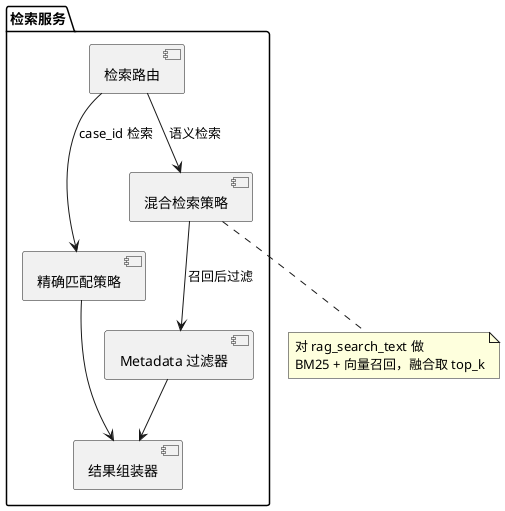

### 2.2.3 CTR 数据适配器

封装对 CTR 平台的访问，按用例拉取结构化执行数据（用例信息、产品信息、执行环境、失败日志、失败逻辑、错误堆栈等），供经验生成与 metadata 索引使用。CTR schema 直接引用，不二次建模。

### 2.2.4 分析聚类模块

基于 metadata 与 root_cause 提供过滤、统计（`failure_type` 频率等）与聚类能力，输出高频失败模式，反哺调测知识建设。

## 2.3 数据流

### 录入数据流

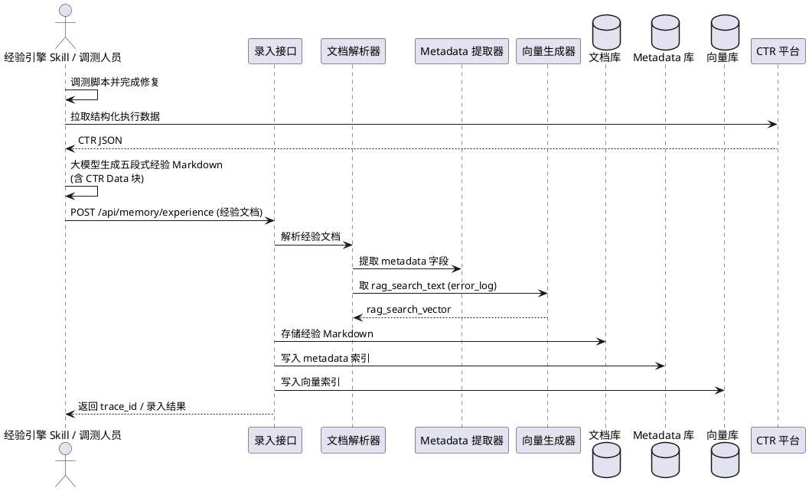

### 检索数据流

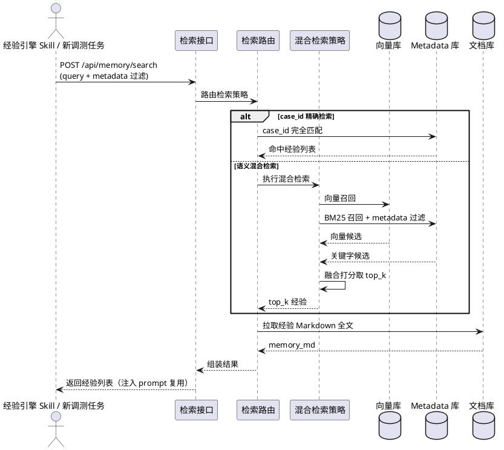

数据流说明：

1. **录入流**：调测完成后一次性生成经验文档，CTR 数据在生成阶段嵌入；接口侧完成解析、索引、入库三件事，避免过程中多次写入导致记录不完整。
2. **检索流**：以错误信息作为 query，经精确/混合策略召回，结果以完整 Markdown 返回并由经验引擎 Skill 注入 Agent 上下文，形成 RAG 闭环。
3. **共同点**：两条流均以经验文档为权威数据，metadata 与向量仅为派生索引。

## 2.4 与外部依赖的关系

| 外部依赖 | 提供能力 | 本系统自研边界 |
|---------|---------|--------------|
| 经验引擎 Skill | 在工作流中触发录入/检索 | 仅提供接口，不实现其触发逻辑 |
| CTR 平台 | 结构化执行数据（schema 已定义） | 仅引用与提取，不二次建模 |
| 云见经验中心接口 | 统一录入/检索协议 | 适配映射，复用统一通道 |
| 向量化 / LLM 服务 | 向量化、字段总结 | 调用与编排，不训练模型 |
| 向量 / Metadata 存储 | 向量检索、结构化过滤 | 通过存储抽象访问，可替换实现 |

## 2.5 架构优势

1. **经验与 Skill 解耦**：新增经验不增加 Skill 数量，维护可持续。
2. **可读与可检索兼得**：五段式 Markdown 既便于人工阅读，又可解析出 metadata 与向量。
3. **沉淀闭环完整**：本地生成 → 录入索引 → 检索复用 → 分析聚类，经验持续增长。
4. **冷启动可控**：存量 Excel 语义入库为飞轮启动期提供初始经验池。
5. **演进友好**：检索策略与存储后端均解耦，可平滑扩展。

---

# 3. 详细设计

## 3.1 经验 Markdown 格式（五段式）

经验文档采用**五段式** Markdown 结构，兼顾人类可读与机器可索引：

| 段落 | 类型 | 用途 | 价值定位 |
|------|------|------|---------|
| `debug_trace` | text | 按时间顺序还原完整调试过程 | 复盘 / LLM 理解上下文 |
| `error_log` | text | 关键错误日志行 | **RAG 检索的核心字段** |
| `diff` | code block | 修复代码差异，按文件维度记录关键改动，忽略无实际变更的文件 | 直接指导修复 |
| `root_cause` | text | 归一化根因分析 | 聚类分析 / 分类优化 |
| `pattern` | text | `[触发场景] → [修复动作]` 的可复用规则 | **经验复用的核心** |

**文档之外的派生字段**：

- **Metadata 索引**：关键元数据（`case_id`、`case_name`、`product_version`、`user_id` 等）入 Metadata 索引，用于精确过滤。
- **RAG 检索字段**：`error_log` 文本入 `rag_search_text` 字段并向量化，用于语义检索。

> 约束：若本次修改无效，`root_cause` 需明确说明问题尚未修复，`pattern` 应指向正确的排查方向而非无效的修改动作。

## 3.2 Metadata 与索引字段设计

经验入库时解析文档并构建三类索引：文档库存全文、metadata 库支持过滤、向量库支持语义检索。其中 `case_id` 用于精确匹配，`rag_search_text`（源自 `error_log`）用于语义混合检索，其余字段多来自 CTR 数据，作为可选过滤或展示字段。

| 字段 | 类型 | 用途 |
|------|------|------|
| `trace_id` | keyword | 轨迹唯一 ID |
| `case_id` | keyword | 用例 ID，精确匹配检索 |
| `case_name` | keyword | 用例名称 |
| `rag_search_text` | text | 语义检索文本（源自 error_log，BM25） |
| `rag_search_vector` | dense_vector | 语义检索向量 |
| `root_cause` | text | 根因（聚类/分析） |
| `product_version` | keyword | 可选过滤 |
| `product_name` | keyword | 可选过滤 |
| `execute_type` | keyword | 可选过滤 |
| `failure_type` / `failure_subtype` | keyword | 失败分类（统计/聚类） |
| `fail_pco` / `fail_aw` / `fail_logic` | keyword | 失败定位字段 |
| `fail_script_line` / `fail_section` | keyword | 失败位置 |
| `failure_log_link` / `failure_slgz_link` | keyword | 日志链接 |
| `issue_number` / `dts_number` | keyword | 问题单 |
| `user_id` | keyword | 分析人 |

> 说明：检索时统一返回除向量字段外的所有字段（向量本身不回传）。

## 3.3 检索设计

系统提供两种检索方式：

- **用例 ID 检索**：`case_id` 完全匹配，命中后返回该用例下所有轨迹（除向量字段外的全部字段）。
- **语义混合检索**：对 `rag_search_text`（源自 error_log）做混合检索（BM25 关键字召回 + 向量语义召回，融合打分），每次返回可配置 `top_k`；支持按 `product_version`、`product_name`、`execute_type` 可选过滤。

混合检索打分（示意）：

```
final_score = α * bm25_score_norm + (1 - α) * vector_score_norm
其中 α 为可调权重；归一化后融合，再按 metadata 过滤裁剪，最后取 top_k。
```

## 3.4 存量经验迁移设计（方案③）

存量经验来源于历史分析 Excel（含 CaseId、用例名称、失败分类行、错误信息、DIFF 比对信息、失败原因、失败原因详情等字段）。迁移时复用云见统一录入接口，通过"字段映射 + 大模型语义总结"自动转换为五段式经验 Markdown 批量入库。

### 入库字段映射

| 入库接口字段 | Excel 字段 / 来源 | 说明 |
|------------|-----------------|------|
| `scene` | 固定字符串 | "测试脚本调测经验" |
| `scene_id` | 固定字符串 | "310" |
| `title` | 用例名称 + experience | 大模型生成十几字标题 |
| `summary` | 用例名称 + experience | 大模型生成几十字概述 |
| `experience` | 多字段组合 | 五段式 Markdown（debug_trace/error_log/diff/root_cause/pattern） |
| `rag_search_text` | experience.error_log | 错误日志文本，用于 RAG 检索 |
| `meta_data.case_id` | CaseId | 测试用例 ID |
| `meta_data.case_name` | 用例名称 | 测试用例名称 |
| `product.version_name` | 产品版本 | 产品版本号 |
| `user_id` | 分析人 | 分析人 |

> 说明：`title`/`summary` 是云见录入契约所需字段，由大模型基于 experience 生成；经验文档本体保持五段式结构。

### 五段式提取策略

- **Debug Trace**：取"上次失败分类行"、"用例结果/最新用例结果"、"失败分类行"并与上次对比——还原"上次结果 → 本次修改 → 修改后结果"的时间线；若两次失败分类行一致，说明修改无效。
- **Error Log**：取"失败分类行" + "错误信息"拼接，作为 RAG 检索文本。
- **Diff**：仅提取"DIFF 比对信息"中有实际变更的部分，忽略 No Differences Found 文件，按文件维度简洁描述。
- **Root Cause**：综合"失败原因" + "失败原因详情" + Debug Trace 推断，不照搬原文；若修改无效需说明问题未修复。
- **Pattern**：根据 Debug Trace 和 Root Cause 提炼为 `[触发场景] → [修复动作]` 规则；若本次修改无效，应指向正确排查方向。

迁移处理流程：

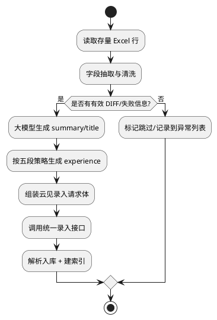

---

# 4. UML 4+1 视图

## 4.1 逻辑视图

### 4.1.1 核心类图

类设计遵循 SOLID：经验文档与存储/检索解耦，检索策略采用策略模式（开闭原则），服务层依赖抽象（依赖倒置）。经验引擎 Skill 作为外部调用方不在类图内展开。

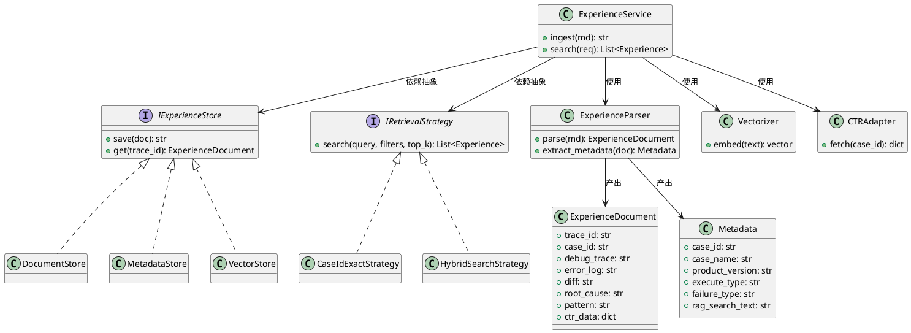

### 4.1.2 经验录入执行流程

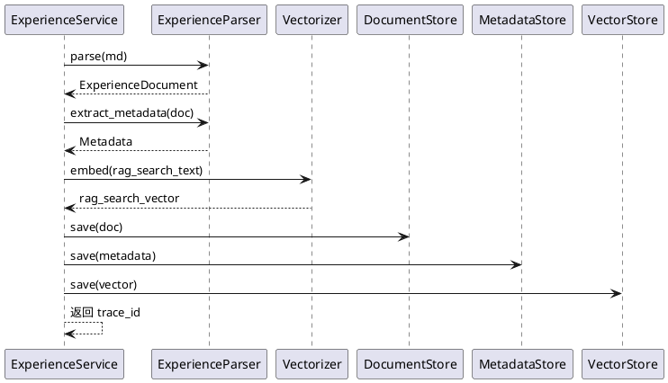

## 4.2 开发视图

### 4.2.1 包依赖图

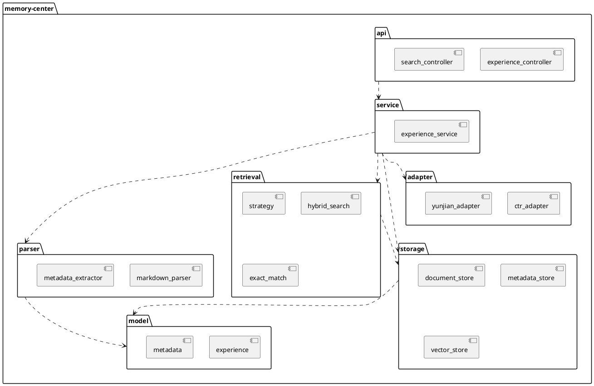

## 4.3 进程视图

### 4.3.1 并发模型

录入侧"写文档库 / 写 metadata / 写向量"可并行；检索侧"向量召回 / BM25 召回"可并行后融合。

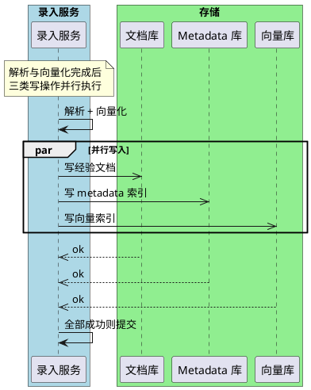

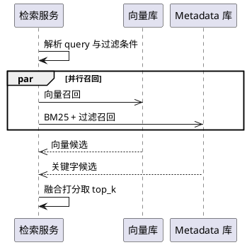

## 4.4 物理视图

### 4.4.1 部署图

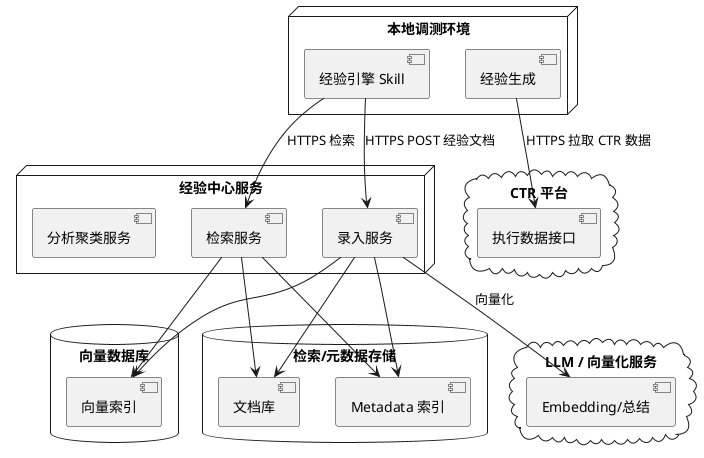

## 4.5 场景视图

### 4.5.1 核心用例图

经验引擎 Skill 与调测人员作为参与者触发用例；其内部触发逻辑不在用例内展开。

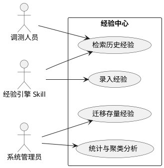

### 4.5.2 典型场景：失败复用闭环

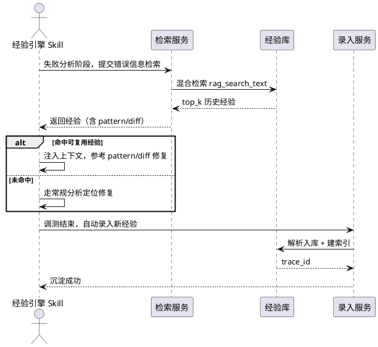

## 4.6 视图整合

1. **逻辑视图**展示经验文档、存储与检索策略的类结构及 SOLID 落地；
2. **开发视图**展示经验中心各包依赖；
3. **进程视图**展示录入三写并行与检索双路召回的并发模型；
4. **物理视图**展示本地生成、经验中心服务与外部 CTR/LLM 的部署关系；
5. **场景视图**展示经验引擎 Skill 触发的"检索复用 → 沉淀新经验"闭环。

---

# 5. DFX 分析

## 5.1 可靠性 (Reliability)

| 方面 | 现状分析 | 设计考量 |
|------|---------|---------|
| 错误处理 | 录入涉及解析、向量化、三类写入，任一失败需可控 | 解析失败拒绝并返回明确错误；写入失败回滚或标记补偿 |
| 幂等性 | 同一经验可能重复录入 | 以 `trace_id` 为幂等键，重复录入做 upsert |
| 外部依赖容错 | CTR/LLM/向量库可能不可用 | 录入降级：先落文档库，再异步补建索引 |
| 数据一致性 | 文档/metadata/向量三处需一致 | 以文档库为权威源，索引可基于文档重建 |

**后续迭代计划**：增加索引一致性校验任务，定期基于文档库重建缺失索引。

## 5.2 可扩展性 (Scalability)

| 方面 | 现状分析 | 设计考量 |
|------|---------|---------|
| 经验扩展 | 经验数据与 Skill 解耦 | 新增经验仅入库，不增加 Skill（治本可维护性） |
| 检索策略扩展 | 当前精确 + 混合检索 | 策略模式，新增 rerank/多路召回只需实现接口 |
| 存储后端扩展 | 文档/向量/metadata 各一实现 | 通过 `IExperienceStore` 抽象隔离，可替换引擎 |
| 数据量增长 | 经验持续积累 | 索引支持分片；向量库可水平扩展 |

## 5.3 可维护性 (Maintainability)

| 方面 | 现状分析 | 设计考量 |
|------|---------|---------|
| Skill 维护 | 每经验独立 Skill 会泛滥 | 经验数据化、与 Skill 解耦，从根本规避泛滥 |
| 模块解耦 | 录入/检索/分析职责分离 | 单一职责，读写解耦 |
| 数据结构维护 | CTR 已有完整 schema | 直接引用，不重复维护 |
| 可读性 | 经验为五段式 Markdown | 人工可直接阅读调试经验 |

## 5.4 安全性 (Security)

| 方面 | 现状分析 | 设计考量 |
|------|---------|---------|
| 访问控制 | 录入/检索接口对外暴露 | 接口鉴权，按角色控制权限 |
| 敏感数据 | 文档含环境 IP、日志链接 | 敏感字段访问可控；按需脱敏 |
| 日志安全 | 异常堆栈可能含敏感信息 | 系统日志避免打印完整敏感堆栈 |
| 输入校验 | 录入接口接收外部文档 | 校验文档结构与字段，防注入与超大体积 |

## 5.5 性能 (Performance)

| 方面 | 现状分析 | 设计考量 |
|------|---------|---------|
| 录入时延 | 含解析与向量化 | 三类写入并行；向量化可批处理；P95 < 2s |
| 检索时延 | 双路召回 + 融合 | 并行召回；`top_k` 限制；P95 < 500ms |
| 批量迁移 | 存量万级条目 | 离线批量导入 + 限流，避免冲击在线服务 |

## 5.6 可观测性 (Observability)

| 方面 | 现状分析 | 设计考量 |
|------|---------|---------|
| 日志 | 录入/检索关键路径 | 记录 trace_id、耗时、命中率（脱敏） |
| 指标 | 需量化系统价值 | 监控录入量、检索 QPS、命中率、复用率 |
| 链路追踪 | 跨 CTR/LLM/存储调用 | 关键调用埋点，定位慢/失败环节 |

---

# 6. 接口设计

采用"文档式录入"：不在调测过程中频繁写轨迹，而在调测结束后一次性录入完整经验文档。原因：①过程中数据不完整（根因、diff、验证结果需调试完成才确定）；②简化接口，系统只处理完整经验记录，无需维护复杂状态更新逻辑。两个接口均由经验引擎 Skill 或调测人员调用。

## 6.1 经验录入接口

```
接口名称：录入经验文档
请求方式：POST
URL：/api/memory/experience
```

处理流程：①接收经验 Markdown 文档 → ②解析五段式结构与 CTR Data → ③提取 metadata → ④存储经验文档 → ⑤更新检索索引。

请求体（关键字段）：

| 字段 | 说明 |
|------|------|
| `scene` / `scene_id` | 场景标识（"测试脚本调测经验" / "310"） |
| `title` / `summary` | 大模型生成的标题与概述 |
| `experience` | 五段式经验 Markdown（debug_trace/error_log/diff/root_cause/pattern） |
| `rag_search_text` | 错误日志文本，用于 RAG 检索 |
| `meta_data` | `case_id`、`case_name` 等 |
| `product` | `version_name` 等 |
| `user_id` | 分析人 |

## 6.2 经验检索接口

```
接口名称：检索经验
请求方式：POST
URL：/api/memory/search
```

请求参数：

| 参数 | 类型 | 说明 |
|------|------|------|
| `query` | string | 用户问题/错误信息，匹配 rag_search_text |
| `top_k` | int | 返回候选数量 |
| `product_name` | string | 可选过滤 |
| `product_version` | string | 可选过滤 |
| `execute_type` | string | 可选过滤 |

请求示例：

```json
{
  "query": "MML_ADD_SMDATA Send Command Error",
  "top_k": 5,
  "product_name": "PS_Solution",
  "product_version": "5G Core 26.1.0"
}
```

响应示例（返回完整经验 Markdown）：

```json
{
  "ok": true,
  "items": [
    {
      "trace_id": "TC_SA_PDU_Session_20260303_101500",
      "case_id": "TC_SA_PDU_Session",
      "score": 1.23,
      "memory_md": "...经验 Markdown 文档..."
    }
  ]
}
```

错误码说明：

| 错误码 | 说明 |
|-------|------|
| 200 | 成功 |
| 400 | 参数错误 / 文档结构非法 |
| 401 | 鉴权失败 |
| 500 | 内部错误（解析/索引异常） |

---

# 7. 测试分析

## 7.1 测试策略

**测试层次**：单元测试、集成测试、系统测试、性能测试。
**测试原则**：自动化优先、关键路径覆盖、外部依赖可 mock、边界与异常场景必测。

## 7.2 单元测试

### 7.2.1 解析器测试

| 测试点 | 测试内容 | 测试方法 |
|-------|---------|---------|
| 五段式解析 | 验证 debug_trace/error_log/diff/root_cause/pattern 正确拆分 | 构造样例文档，校验解析结果 |
| Metadata 提取 | 验证 case_id 等字段准确提取 | 对照预期字段断言 |
| 异常文档 | 缺失必填段落时拒绝并报错 | 构造残缺文档，校验报错 |

### 7.2.2 检索策略测试

| 测试点 | 测试内容 | 测试方法 |
|-------|---------|---------|
| 精确匹配 | case_id 命中返回全部轨迹 | mock 存储，校验返回集合 |
| 混合检索 | 融合打分与 top_k 截断正确 | 构造候选，校验排序与数量 |
| metadata 过滤 | 过滤条件正确生效 | 带过滤检索，校验结果范围 |

## 7.3 集成测试

| 测试点 | 测试内容 | 测试方法 |
|-------|---------|---------|
| 录入闭环 | 文档→解析→向量→三库写入一致 | 容器化依赖，端到端录入校验 |
| 检索闭环 | query→召回→返回完整 Markdown | 预置经验后检索校验命中 |
| CTR 集成 | 拉取 CTR 数据并嵌入文档 | mock/联调 CTR 接口 |
| 存量迁移 | Excel→映射→五段生成→入库 | 抽样校验生成经验质量 |

## 7.4 系统与性能测试

| 测试点 | 测试内容 | 验收标准 |
|-------|---------|---------|
| 录入时延 | 单条录入端到端耗时 | P95 < 2s |
| 检索时延 | top_k≤10 检索耗时 | P95 < 500ms |
| 批量迁移 | 万级存量导入稳定性 | 无数据丢失、限流可控 |
| 检索命中率 | 相似失败的复用命中 | 持续监控并优化 |

---

# 8. 附录：经验 Markdown 五段式示例

`experience` 字段存储如下五段式 Markdown 字符串：

```markdown
# Debug Memory

Trace ID: TC_SA_PDU_Session_20260303_101500
Case ID: TC_SA_PDU_Session

## Debug Trace
1. 上次失败：fail_logic = MML_ADD_SMDATA，Precondition 阶段命令执行失败
2. 本次修改：补充 UE 初始化配置
3. 修改后：脚本恢复正常，失败分类行不再复现

## Error Log
失败分类行: MML_UDM_PGW_PUB;MmlRun;MML_ADD_SMDATA;empty;empty
错误信息: pythonspidersdk.execption.PythonSpiderSdkError: Run AW failed,PcoName:MML_UDM_PGW_PUB,AW:MmlRun

## Diff
（按文件维度记录有实际变更的改动；忽略 No Differences Found 文件）

## Root Cause
MML_ADD_SMDATA 执行失败，根因是执行环境中的 UE 数据未正确初始化，导致命令执行失败。

## Pattern
[触发场景] Precondition 阶段执行 MML_ADD_SMDATA 前 UE 未初始化
→ [修复动作] 先校验/补齐 UE 初始化，再执行 MML 命令

## CTR Data
{
  "case_id": "TC_SA_PDU_Session",
  "product_name": "PS_Solution",
  "product_version": "5G Core 26.1.0.B240",
  "failure_type": "脚本问题",
  "execute_type": "CLOUD_SPIDER",
  "fail_pco": "MML_UDM_PGW_PUB",
  "fail_aw": "MmlRun",
  "fail_logic": "MML_ADD_SMDATA",
  "fail_script_line": "line 134",
  "failure_log_link": "http://fs-ps-solution.coretestresult.../TC_SA_PDU_Session.log"
}
```

系统在入库时解析 CTR Data 块用于建立 metadata 索引与统计分析，并对 `error_log`（写入 `rag_search_text`）生成向量用于语义检索。
