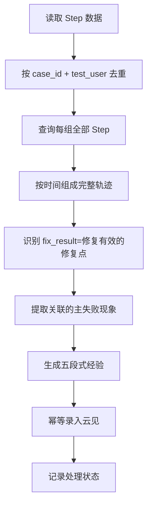

# 调测轨迹经验提取最简方案

## 1. 背景与目标

调测平台持续产生 Step 数据，其中包含脚本失败信息、修改内容和修复结果。需要在 memory 服务中增加一条最简自动化链路：

1. 获取 Step 数据；
2. 按 `case_id + test_user` 聚合完整调测轨迹；
3. 从轨迹中识别经过有效修复的主失败现象；
4. 生成结构化调测经验；
5. 将经验录入云见经验中心。

本方案仅描述业务处理流程和数据规则，不涉及 memory 服务的具体代码结构、框架选型和部署实现。

## 2. 核心原则

### 2.1 经验粒度

经验的最小单位为：

```text
一条轨迹中的一次有效修复 + 一个主失败现象 = 一条经验
```

具体规则如下：

- 相同 `case_id + test_user` 的全部 Step 按时间排序后组成一条完整轨迹；
- 一条轨迹包含多次有效修复时，按不同失败现象生成多条经验；
- 每次有效修复只提取与本次修改直接关联的主失败现象；
- 同一失败现象出现在不同轨迹中，分别生成经验，不跨轨迹合并；
- 不增加人工待审核流程，符合条件的经验直接录入云见；
- 无成功修复的轨迹不生成经验。

### 2.2 失败现象

失败现象由大模型根据失败日志总结，必须包含：

```text
主语 + 核心失败表现
```

失败现象只描述“谁发生了什么错误”，不包含根因和修复动作。

示例：

```text
UDG_MML_AddSaDedicBearer_Restore 配置 HTTP 协议组时返回 22952，
并提示找不到匹配的 DftProtGrp。
```

### 2.3 修复有效性

修复是否有效以源数据中的 `fix_result=修复有效` 为准。

在此基础上还需满足：

- `diff_content.hasChanged=true`；
- `diff_content.changedLines` 非空；
- 修改内容能够与主失败位置、失败逻辑或核心错误信息建立直接关联。

以下情况不生成经验：

- `fix_result` 不是“修复有效”；
- 没有实际代码修改；
- 只增加日志、诊断或快速失败能力，但不能证明原故障已解决；
- 修改与主失败现象缺少直接关联；
- 只有失败记录，没有成功修复闭环。

## 3. 最简业务流程



### 3.1 Step 数据获取

数据接口提供两类查询能力：

1. **增量查询**：按 `update_time + id` 联合游标获取游标之后新增或更新的 Step；
2. **轨迹查询**：按 `case_id + test_user` 获取该组合下的全部 Step。

增量查询结果只用于发现发生变化的 `case_id + test_user`。同一组合在一批增量数据中出现多次时，只查询和处理一次完整轨迹。

试运行阶段通过 `update_time` 限定截止时间，只处理指定时间点之前的数据；验证无问题后，再补充处理其他历史数据并启用持续增量同步。具体截止时间通过配置提供。

### 3.2 轨迹聚合

轨迹聚合键为：

```text
case_id + test_user
```

同一组合的 Step 按以下字段升序排列：

1. `start_time`
2. `end_time`
3. `update_time`
4. `id`

`test_user` 为空、空字符串或无有效值时，统一按 `"0"` 处理。

### 3.3 有效修复识别

系统遍历完整轨迹，定位所有 `fix_result=修复有效` 的修复点，并结合修复点前后的 Step 判断：

- 修改前发生了什么主失败；
- 本次修改包含哪些实际变更；
- 修改后原失败是否不再复现；
- 哪部分修改与主失败直接相关。

一条轨迹存在多个有效修复点时分别处理。一次有效修复包含多处修改时，只保留能够由失败证据支持的关联修改，忽略无关改动。

### 3.4 大模型经验提取

大模型输入完整轨迹，输出每个有效修复点对应的一条经验候选。每条候选至少包括：

- 标准化失败现象；
- Debug Trace；
- Error Log；
- Diff；
- Root Cause；
- Pattern；
- 标题；
- 摘要；
- 补充检索文本；
- 关联的来源 Step ID。

系统需校验输出结构，并确保每条经验只包含一个主失败现象。

### 3.5 云见录入

通过云见经验写入接口录入经验。调用方传入稳定 `doc_id`：

- 首次处理时创建经验；
- 同一有效修复点因源 Step 更新而重新处理时，使用相同 `doc_id` 覆盖原经验；
- 不同轨迹或不同有效修复点使用不同 `doc_id`。

云见自身负责经验字段向量化、版本归档和质量检测。

## 4. 经验格式

`experience` 使用五段式 Markdown 字符串。

```markdown
## Debug Trace

1. 上次失败：<失败逻辑、执行阶段和失败现象>
2. 本次修改：<与主失败直接关联的修改摘要>
3. 修改后：<修复验证结果>

## Error Log

失败分类行：<失败分类信息>
错误信息：<核心错误信息>

## Diff

<按文件维度记录与主失败直接关联的实际修改；忽略无变更文件和无关修改>

## Root Cause

<根据失败日志、执行上下文和有效修改总结的根因>

## Pattern

[触发场景] <可复现条件>
→ [修复动作] <经过验证的修复方式>
```

各段用途如下：

| 段落 | 内容要求 |
| --- | --- |
| Debug Trace | 描述“修改前失败 → 本次修改 → 修改后结果”的闭环，并记录当前轨迹的真实 `test_user` |
| Error Log | 保留失败分类行和能够代表失败现象的核心错误文本 |
| Diff | 仅保留与主失败直接相关的实际修改，按文件维度组织 |
| Root Cause | 解释失败原因，不简单复述错误日志 |
| Pattern | 提炼为可复用的“触发场景 → 修复动作”规则 |

## 5. 云见字段映射

| 云见字段 | 取值规则 |
| --- | --- |
| `scene` | 固定为“测试脚本调测经验” |
| `scene_id` | 固定为 `"421"` |
| `doc_id` | 根据 `group_id + 有效修复 Step ID` 生成稳定标识 |
| `title` | 大模型生成“主语 + 核心失败表现”，不包含根因和修复动作 |
| `summary` | 简要概括失败现象、根因和已验证修复动作 |
| `experience` | 五段式 Markdown |
| `rag_search_text` | 结构化失败特征、标准化失败现象和核心错误日志的组合文本 |
| `user_id` | 取当前轨迹的 `test_user`，为空填 `"0"` |
| `product.product_id` | 取源数据的 `group_id` |
| `metadata.product` | 取数据接口返回的 `product` 字段 |

建议在 `metadata` 中同时保存：

- `case_id`
- `test_user`
- `source_step_ids`
- `fix_step_id`
- `fail_pco`
- `fail_aw`
- `fail_logic`
- `fail_detail`
- `trace_updated_at`
- `extraction_version`

如果已创建经验的 `user_id="0"`，后续同一来源修复点补充了真实 `test_user`，覆盖更新时同步更新 `user_id`；原值不是 `"0"` 时保持不变。

## 6. 标题与检索文本

### 6.1 标题

推荐格式：

```text
主语 + 发生场景或动作 + 核心失败表现
```

示例：

```text
UDG_MML_AddSaDedicBearer_Restore 配置 HTTP 协议组时返回 22952
```

标题不应包含“将某参数修改为某值”等修复动作，否则标题会与失败现象混淆。

### 6.2 补充检索文本

`rag_search_text` 建议组合以下内容：

```text
产品 + failPco + failAw + failLogic + failDetail/错误码
+ 标准化失败现象 + 核心错误文本
```

该字段用于云见的 BM25 与向量混合检索。产品通过 `product.product_id` 进行隔离过滤。

## 7. 幂等与状态管理

### 7.1 经验幂等

最简方案以“有效修复 Step”为稳定来源，建议使用以下内容生成 `doc_id`：

```text
group_id + fix_step_id
```

同一修复 Step 的内容更新后，`doc_id` 不变，重新提取并覆盖原经验，从而避免重复创建。

由于一次有效修复只提取一个与修改直接关联的主失败现象，因此 `fix_step_id` 可以唯一对应一条经验。

### 7.2 处理状态

memory 服务至少保存：

- 最近成功处理的 `update_time + id` 游标；
- 已处理的有效修复 Step ID；
- 对应的云见 `doc_id`；
- 轨迹最近更新时间或内容摘要；
- 处理状态、重试次数和最后错误。

只有当前分页数据完成处理或失败状态已可靠记录后，才能推进增量游标。

### 7.3 重新处理

发生以下情况时重新查询并处理完整轨迹：

- 新增 Step；
- 旧 Step 的 `fix_result` 更新；
- `diff_content`、错误信息或其他经验相关字段更新。

重新处理后：

- 原来不满足条件、现在满足条件：创建经验；
- 原来已经创建且内容发生变化：覆盖原经验；
- 内容未变化：不重复写入；
- 单条轨迹处理失败：记录失败原因，后续重试。

## 8. 异常处理

| 异常场景 | 最简处理方式 |
| --- | --- |
| Step 增量接口失败 | 不推进游标，下次重试 |
| 完整轨迹接口失败 | 记录失败组合，后续重试 |
| 数据字段缺失 | 记录跳过原因，不生成低可信经验 |
| 大模型调用失败或输出不合法 | 有限次数重试，仍失败则记录 |
| 无有效修复 | 正常跳过 |
| 云见写入失败 | 保留待写入结果并重试，不推进该记录状态 |
| 重复收到相同 Step | 通过 `doc_id` 和内容摘要保证幂等 |

单条轨迹失败不应阻塞同批其他轨迹，但本批游标推进前必须确保失败项已进入可重试状态。

## 9. 试运行方案

第一阶段只处理指定 `update_time` 截止时间之前的一小批真实数据，验证以下内容：

1. `case_id + test_user` 能否正确还原完整轨迹；
2. 多次有效修复能否按失败现象拆分为多条经验；
3. 无效修改和无关 Diff 能否被过滤；
4. 标题是否稳定表达“主语 + 失败现象”；
5. 五段式经验是否与原始轨迹证据一致；
6. `user_id`、`product_id` 和 `metadata.product` 映射是否正确；
7. 重复执行是否不会产生重复经验；
8. Step 更新后是否能覆盖原经验。

试运行通过后，再补充其他历史数据，并开启基于 `update_time + id` 的持续增量处理。

## 10. 验收标准

- 能够按 `case_id + test_user` 获取并排序完整轨迹；
- 仅为 `fix_result=修复有效` 且存在关联实际修改的数据生成经验；
- 一次有效修复只生成一个主失败现象经验；
- 一条轨迹中的多个有效修复可生成多条经验；
- 不同轨迹的相似失败现象分别保存；
- 经验内容符合五段式 Markdown 格式；
- 标题仅描述失败现象，不混入根因或修复动作；
- 字段映射符合本方案约定；
- 重复处理不会重复创建经验；
- 源 Step 更新后能够覆盖对应经验；
- 单条处理失败可追踪、可重试且不丢失。

## 11. 暂不纳入范围

最简版本暂不包含：

- 跨轨迹同类失败现象的合并与持续归纳；
- 人工审核和待审核状态；
- 失败但未修复轨迹的经验沉淀；
- 无效修改和失败尝试的反例库；
- 经验聚类、统计分析和自动知识治理；
- memory 服务内部代码结构和具体技术实现；
- 调测 Step 接口的最终地址、鉴权和分页参数细节。
